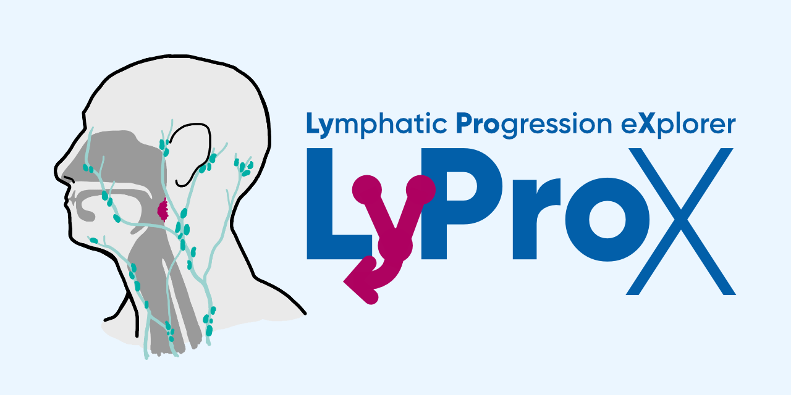

## What is LyProX?

It is a [Django] web app that displays the detailed patterns of lymphatic metastases in head & neck cancer and allows one to explore the underlying dataset(s) in much detail. It is hosted under the URL <https://lyprox.org>.

[Django]: https://www.djangoproject.com/

## Motivation

HNSCC spreads though the lymphatic system of the neck and forms metastases in regional lymph nodes. Macroscopic metastases can be detected with imaging modalities like MRI, PET and CT scans. They are then consequently included in the target volume, when radiotherapy is chosen as part of the treatment. However, microscopic metastases are too small be diagnosed with current imaging techniques.

To account for this microscopic involvement, parts of the lymphatic system are often irradiated electively to increase tumor control. Which parts are included in this elective clinical target volume is currently decided based on guidelines [^1] [^2] [^3] [^4]. These in turn are derived from reports of the prevalence of involvement per lymph node level (LNL), i.e. the portion of patients that were diagnosed with metastases in any given LNL, stratified by primary tumor location. It is recommended to include a LNL in the elective target volume if 10 - 15% of patients showed involvement in that particular level.

However, while the prevalence of involvement has been reported in the literature [^5] [^6], and the general lymph drainage pathways are understood well, the detailed progression patterns of HNSCC remain poorly quantified. We believe that the risk for microscopic involvement in an LNL depends highly on the specific diagnose of a particular patient and their treatment can hence be personalized if the progression patterns were better quantified.

## Our Goal

With the interface we primarily aim to make our extracted dataset easily accessible. By visualizing it interactively, one can very quickly test or come up with hypothesis regarding the lymphatic spread of HNSCC. Hopefully, this in turn motivates other researchers to investigate these hypotheses, extract and share more data in similar detail.

This, in turn would enable us (or anyone, really) to build more accurate and precise tumor progression models. E.g. like previous work on using Bayesian networks to predict the personalized probability of involvement [^7] or our recent publication on this issue using hidden Markov models and thereby introducing an explicit way of modelling time [^8].

## Datasets of Lymphatic Progression Patterns

The data that is visualized in this interface lives in an open-source repository on its own: [lyDATA].

We have also published a paper on the dataset and the interface in *Radiotherapy & Oncology* [^9], with a preprint being available on *medRxiv* [^10].

[lyDATA]: https://github.com/lycosystem/lydata

## Probabilistic Models for Personalized CTV Definition

We also work on probabilistic models [^7] [^8] that may predict the lymphatic spread of head & neck cancer. The underlying code is hosted in another repository: [lymph].

[lymph]: https://github.com/lycosystem/lymph

## How to contribute

There are two ways you can contribute to this project:

1. If you are a clinical researcher in the field and would like to share your data with us, please get in touch with us via email: [roman.ludwig@usz.ch].
2. The other way is by contributing to this repository, e.g. if you are a software developer. I guess this is somewhat unlikely, due to the very specific scope of this Django app, but we still welcome any contribution. In this case, a [detailed documentation] of the source code can be consulted.

[roman.ludwig@usz.ch]: mailto:roman.ludwig@usz.ch
[detailed documentation]: https://lycosystem.github.io/lyprox

## Run this interface locally

If you want to host your data yourself or try how your data looks in the web app without committing to an upload, feel free to follow [these instructions] to get it up and running on your local machine.

[these instructions]: run-local.md

[^1]: Vincent Grégoire and Others, **Selection and delineation of lymph node target volumes in head and neck conformal radiotherapy. Proposal for standardizing terminology and procedure based on the surgical experience**, *Radiotherapy and Oncology*, vol. 56, pp. 135-150, 2000, doi: <https://doi.org/10.1016/S0167-8140(00)00202-4>.
[^2]: Vincent Grégoire, A. Eisbruch, M. Hamoir, and P. Levendag, **Proposal for the delineation of the nodal CTV in the node-positive and the post-operative neck**, *Radiotherapy and Oncology*, vol. 79, no. 1, pp. 15-20, Apr. 2006, doi: <https://doi.org/10.1016/j.radonc.2006.03.009>.
[^3]: Vincent Grégoire et al., **Delineation of the neck node levels for head and neck tumors: A 2013 update. DAHANCA, EORTC, HKNPCSG, NCIC CTG, NCRI, RTOG, TROG consensus guidelines**, *Radiotherapy and Oncology*, vol. 110, no. 1, pp. 172-181, Jan. 2014, doi: <https://doi.org/10.1016/j.radonc.2013.10.010>.
[^4]: Julian Biau et al., **Selection of lymph node target volumes for definitive head and neck radiation therapy: a 2019 Update**, *Radiotherapy and Oncology*, vol. 134, pp. 1-9, May 2019, doi: <https://doi.org/10.1016/j.radonc.2019.01.018>.
[^5]: Jatin. P. Shah, F. C. Candela, and A. K. Poddar, **The patterns of cervical lymph node metastases from squamous carcinoma of the oral cavity**, *Cancer*, vol. 66, no. 1, pp. 109-113, 1990, doi: <https://doi.org/10.1002/1097-0142(19900701)66:1%3C109::AID-CNCR2820660120%3E3.0.CO;2-A>.
[^6]: Laurence Bauwens et al., **Prevalence and distribution of cervical lymph node metastases in HPV-positive and HPV-negative oropharyngeal squamous cell carcinoma**, *Radiotherapy and Oncology*, vol. 157, pp. 122-129, Apr. 2021, doi: <https://doi.org/10.1016/j.radonc.2021.01.028>.
[^7]: Bertrand Pouymayou, P. Balermpas, O. Riesterer, M. Guckenberger, and J. Unkelbach, **A Bayesian network model of lymphatic tumor progression for personalized elective CTV definition in head and neck cancers**, *Physics in Medicine & Biology*, vol. 64, no. 16, p. 165003, Aug. 2019, doi: <https://doi.org/10.1088/1361-6560/ab2a18>.
[^8]: Roman Ludwig, B. Pouymayou, P. Balermpas, and J. Unkelbach, **A hidden Markov model for lymphatic tumor progression in the head and neck**, *Sci Rep*, vol. 11, no. 1, p. 12261, Dec. 2021, doi: <https://doi.org/10.1038/s41598-021-91544-1>.
[^9]: Roman Ludwig et al., **Detailed patient-individual reporting of lymph node involvement in oropharyngeal squamous cell carcinoma with an online interface**, *Radiotherapy and Oncology*, Feb. 2022, doi: <https://doi.org/10.1016/j.radonc.2022.01.035>.
[^10]: Roman Ludwig, J.-M. Hoffmann, B. Pouymayou et al., **Detailed patient-individual reporting of lymph node involvement in oropharyngeal squamous cell carcinoma with an online interface**, *medRxiv*, Dec. 2021. doi: <https://doi.org/10.1101/2021.12.01.21267001>.
